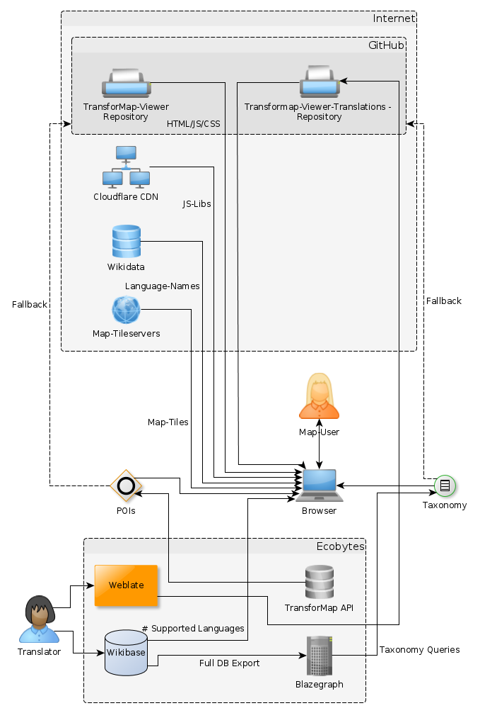

# TransforMap-Viewer

This is a Web-Map plugin that aims at displaying data from the [TransforMap API](https://github.com/TransforMap/data.transformap.co). It offers dynamic filters, which are built from a Wikibase graph hosted on [base.transformap.co](https://base.transformap.co).

## Features

* Displays geoJSON Points
* Clustering via [PruneCluster](https://github.com/SINTEF-9012/PruneCluster)
* Popup with image display, special support for Mediawiki storage
* Filtering system, builds filter menu out of RDF graph provided by Wikibase

## Embedding

To embed the TransforMap-Viewer into your own website, the simplest way is via an iframe:

    <iframe width="1200" height="500" src="http://viewer.transformap.co/#5/51.166/10.451"></iframe>

You can change the background layer via the param "background" (e.g. src="http://viewer.transformap.co/?background=mapnik#5/51.166/10.451"). Currently 4 layers are supported:

* background=stamen_terrain_bg : Default, only terrain without any labels, roads or buildings.
* background=stamen_terrain : terrain with (a few) labels, roads and buildings later
* background=mapnik : Default OpenStreetMap 'Mapnik'/'OSM-Carto' style
* background=hot : Humanitarian OSM style. Temperate colors, very detailed.

If you want to change anything else, e.g. color scheme or the displayed data, fork it and embed it from your fork's gh-pages.

## Translations

Translation for the filter-menu are directly fetched from Wikibase. All other strings are  are handled via [weblate.transformap.co](https://weblate.transformap.co/projects/transformap-viewer/transformap-viewer-textsnipplets/). You can help translating, just sign up! It stores its translations here: https://github.com/TransforMap/transformap-viewer-translations.

Note: The English translations are handled in the source repository directly.

To add new strings, you have to add them currently manually to scripts/map.js and in the translation repository, to each of the language files in json/*.json.

# Development

## Data flows

This service relies heavily on different linked data backends, see flowchart:

## CSS

Is created via [less](http://lesscss.org/).

Do not edit the CSS file in styles/css/style.css, edit styles/less/style.less and compile to css.

Install node *less* compiler to convert the stylesheet to less css:

* Debian: `aptitude install node-less`

Compile it via :

    lessc -x styles/less/style.less styles/css/style.css

## Dependencies

Install *bower* from npm:

    [sudo] npm install -g bower

Debian: install npm:

    [sudo] aptitude install npm nodejs-legacy

Fetch external dependencies:

    bower install

## Deployment

The site http://viewer.transformap.co/ is actually hosted at github.io. Just push the branch gh-pages to update the site.

Notes: for libraries used with bower, add a static copy of the files to the gh-pages branch to its location in bower_components/ (and add an exception to the .gitignore-file).

### build concatenated and minified js/css

Run `npm install` once to install needed development dependencies.

Then, run `npm run build` each time js and/or css has been changed to update the content in the `/dist` folder.

## Coding Style guide

We use spaces (2) instead of tabs, please also use this convention.

## Forks

Currently, there are 3 "branches" of development:

* http://viewer.transformap.co/ - "master" branch, [this](https://github.com/TransforMap/transformap-viewer) repo.
* https://susy-mapviewer.github.io/transformap-viewer/ for embedding into the [solidarityeconomy.eu](http://solidarityeconomy.eu) site. Repo see [here](https://github.com/susy-mapviewer/transformap-viewer).
* https://susy-partners.github.io/transformap-viewer/ for embedding into the websites of SUSY-partners. Repo see [here](https://github.com/susy-partners/transformap-viewer).
